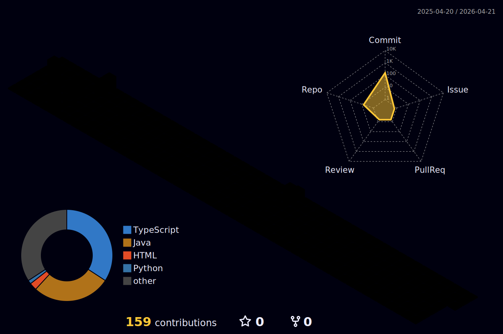

 |  |  |  
 | ----------- | ----------- |

<!--  -->
  
<h1 align="center">Olá! Eu sou o Tiago Molero 👋</h1>

  Desenvolvedor Back-End Java em transição de carreira com base sólida em infraestrutura, suporte técnico e automação. Apaixonado por tecnologia, performance e soluções escaláveis.

---

## 🚀 Sobre mim

- 💻 Comecei no desenvolvimento criando um sistema de gerenciamento de estoque para uma empresa real em Java com RFID.
- 🔧 Atuei por 5 anos com suporte técnico e infraestrutura, lidando com servidores, redes, automações em Python e segurança.
- ☁️ Experiência com Linux, AWS EC2, Docker, Active Directory, GLPI, Grafana, servidores e bancos de dados.
- 🌱 Atualmente, estudo e pratico Java, Spring Boot, arquitetura limpa, testes automatizados, SOLID, Clean Code, microserviços e boas práticas de desenvolvimento.
- 🧠 Estou sempre aprendendo algo novo e focado em evoluir tecnicamente.
- 🤝 Busco contribuir com projetos que gerem valor real e tenham qualidade como prioridade.

---

## 🛠️ Tecnologias e Ferramentas

 

  

	

---

## 📫 Como me encontrar

- LinkedIn: [linkedin.com/in/tiagomolero](https://linkedin.com/in/tiagomolero)
- Email: tiagomolero@gmail.com
- Whatsapp: [+55 (11) 96085-2554](https://wa.me/5511960852554)

---

## ⚡ Diferencial

Já estive do outro lado da mesa — resolvendo incidentes, monitorando ambientes e garantindo estabilidade. Hoje, trago essa visão para desenvolver software com mais responsabilidade, segurança e performance.  
Se você procura alguém com atitude, conhecimento técnico e vontade de fazer acontecer, **estou pronto para o desafio**.